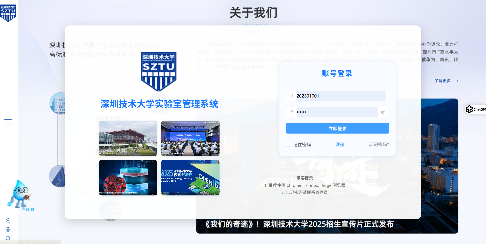
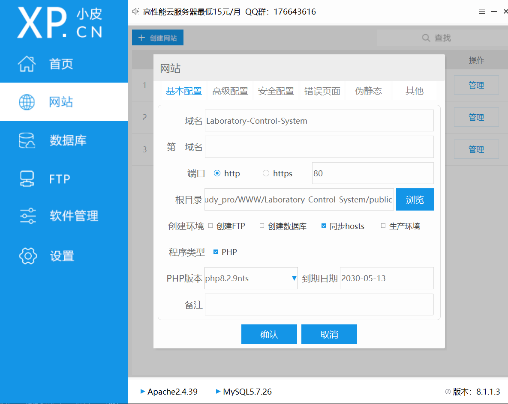

# 实验室设备与资源管理系统

本系统是一个用于实验室资源与设备管理的综合平台，支持设备维护、资源分配、用户权限管理等功能。



## 功能简介

- **资源管理**
  - 管理实验室钥匙、服务器及账号、桌椅、书籍等共享资源
  - 资源分配、归还与状态跟踪
  - 资源报废与出库记录

- **用户与权限管理**
  - 超级管理员、管理员（教师）、普通用户（学生、供应商）三种角色
  - 不同角色拥有不同的操作权限

- **设备管理**
  - 设备库存与状态管理
  - 故障登记（支持故障程度）
  - 设备维修派单、进度跟踪、验收
  - 设备报废与出库

- **维护与通知系统**
  - 故障自动提醒、维修超期提醒
  - 资源消耗预警、补充提醒
  - 多实验室支持，数据隔离

## 技术架构

- **后端**：PHP 8.0+，Slim Framework
- **数据库**：MySQL 5.7+，Eloquent ORM
- **依赖管理**：Composer
- **认证**：JWT（JSON Web Token）
- **API**：RESTful 风格

## 安装与部署

1. 克隆本项目到本地
2. 创建 MySQL 数据库，导入 `database/migrations/001_create_core_tables.sql` 初始化表结构，创建本地数据库
3. 修改 `.env` 中的数据库等配置信息
4. 下来之后删除`/vendor`文件夹
5. 安装依赖：`composer install`
6. 生成应用密钥（如有需要）
7. 前端运行,进入/fronted ,运行`npm run dev`
8. 后端部署,基于phpstudy,配置网站，配置如下

## 前后端目录结构

本项目采用前后端分离架构：

- 后端（PHP）：项目根目录及其子目录（如 app/、public/、database/ 等）
- 前端（Vue 3 + Vite）：frontend/ 目录

### 前端目录结构

```
frontend/
├── public/           # 前端静态资源（如图片），通过 /xxx.png 访问
├── src/
│   ├── views/        # 页面视图组件
│   ├── components/   # 公共组件
│   ├── api/          # API 封装
│   ├── router/       # 路由配置
│   └── main.js       # 入口文件
├── package.json
└── ...
```

### 前端开发与运行

1. 进入 `frontend/` 目录
2. 安装依赖：`npm install`
3. 启动开发服务器：`npm run dev`
4. 访问地址一般为 `http://localhost:5173/`

### 前端图片与静态资源

- 所有前端页面用到的图片（如登录页背景、logo、校园图片等），请放在 `frontend/public/` 目录下。
- 页面引用图片时，路径写为 `/图片名.png`，如 `/campus1.png`。

> 注意：项目根目录的 `public/` 文件夹是后端（PHP）用的，前端页面无法直接访问。

## 目录结构

```
├── app/
│   ├── Controllers/    # 控制器
│   ├── Models/         # 数据模型
│   ├── Middleware/     # 中间件
├── config/             # 配置文件
├── database/
│   ├── migrations/     # 数据库迁移脚本
├── public/             # Web 入口
├── resources/          # 视图与资源
└── routes/             # 路由定义
```

## 数据表设计

- users：用户表，含角色字段
- laboratories：实验室信息
- resources：实验室资源
- equipment：实验室设备
- fault_reports：设备故障报告
- maintenance_tasks：维修任务
- resource_allocations：资源分配记录
- notifications：通知消息

## 安全性

- 密码加密存储（bcrypt）
- JWT 认证，接口安全
- CSRF 防护
- 严格的输入校验与权限控制

## 典型应用场景

- 多实验室资源统一管理
- 设备故障报修与维修流程自动化
- 资源借用、归还与超期提醒
- 供应商、学生、教师多角色协作

## 许可证

MIT License